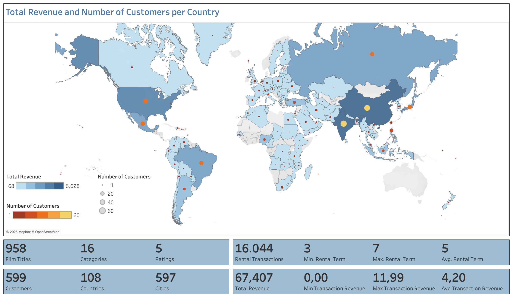
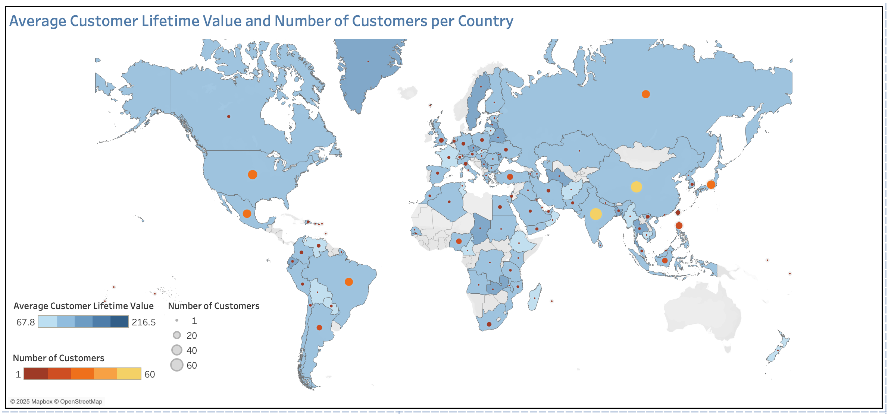

# Streaming Service Database Queries
*This project was completed as part of the [CareerFoundry Data Analytics Programme](https://careerfoundry.com/en/courses/become-a-data-analyst/).*

## Overview
A legacy movie rental company is planning to re-enter the market with a new online streaming service. This project supports the launch strategy by using SQL to query a relational database containing inventory, customer, and payment data. The analysis addresses a series of ad hoc business questions posed by management, helping to identify revenue-driving films, high-value markets, and regional sales trends to inform content strategy and customer targeting.
  

## Tools
- **PostgreSQL** - Relational Database
- **DbVisualizer** - Entity Relationship Diagram
- **Tableau** - Visualisation
- **Excel** - Output
- **Word** - Documentation
- **PowerPoint** - Presentation
  

## Process
- **Understanding** - ERD Creation | Data Dictionary Documentation
- **Data Preparation** - Profiling | Integrity Checks | Quality Checks | Cleaning | Integration
- **Analysis** - Business Rule Validation | Metric Derivation | Ad Hoc Querying
- **Communication** - Visualisation | Presentation
  

## Data
This analysis uses a modified version of the DVD Rental dataset originally provided as a sample database for learning and testing SQL with PostgreSQL. The dataset was adapted and provided by CareerFoundry as part of their Data Analytics Programme.

- [**Dataset**](http://www.postgresqltutorial.com/wp-content/uploads/2019/05/dvdrental.zip) – Film, inventory, customer, payment, and rental records
  

## Links
- [**Entity Relationship Diagram**](deliverables/erd_dbvisualiser.png)
- [**Data Dictionary**](deliverables/data_dictionary.pdf)
- [**Interactive Tableau Dashboard**](https://public.tableau.com/views/StreamingService_17486375379040/Dashboard1?:language=en-GB&:sid=&:redirect=auth&:display_count=n&:origin=viz_share_link)
- [**Presentation**](deliverables/presentation.pdf)
  

## Key Insights
1. The top 5 revenue-generating films earned between ¤205 and ¤232, while 7 films shared the bottom five positions, generating between ¤6 and ¤8.
<table>
<tr>
<td align="center" valign="top" width="50%">
     
    <em>...</em>
</td>
<td align="center" valign="top" width="50%">
     
    <em>...</em>
</td>
</tr>
</table>
 

2. Rental durations across all terms ranged from same-day returns to a maximum of 10, with an average duration of 5 days.
<table style="width:100%; border-collapse: collapse;">
  <thead>
    <tr>
      <th style="text-align: center; padding: 8px; border: 1px solid #ddd;">Rental Duration (Days)</th>
      <th style="text-align: center; padding: 8px; border: 1px solid #ddd;">Number of Transactions</th>
      <th style="text-align: center; padding: 8px; border: 1px solid #ddd;">Minimum Actual Duration</th>
      <th style="text-align: center; padding: 8px; border: 1px solid #ddd;">Maximum Actual Duration</th>
      <th style="text-align: center; padding: 8px; border: 1px solid #ddd;">Average Actual Duration</th>
    </tr>
  </thead>
  <tbody>
    <tr>
      <td style="padding: 8px; border: 1px solid #ddd;">3</td>
      <td style="padding: 8px; border: 1px solid #ddd;">3 366</td>
      <td style="padding: 8px; border: 1px solid #ddd;">0</td>
      <td style="padding: 8px; border: 1px solid #ddd;">10</td>
      <td style="padding: 8px; border: 1px solid #ddd;">5</td>
    </tr>
    <tr>
      <td style="padding: 8px; border: 1px solid #ddd;">4</td>
      <td style="padding: 8px; border: 1px solid #ddd;">3 213</td>
      <td style="padding: 8px; border: 1px solid #ddd;">0</td>
      <td style="padding: 8px; border: 1px solid #ddd;">10</td>
      <td style="padding: 8px; border: 1px solid #ddd;">5</td>
    </tr>
    <tr>
      <td style="padding: 8px; border: 1px solid #ddd;">5</td>
      <td style="padding: 8px; border: 1px solid #ddd;">3 132</td>
      <td style="padding: 8px; border: 1px solid #ddd;">0</td>
      <td style="padding: 8px; border: 1px solid #ddd;">10</td>
      <td style="padding: 8px; border: 1px solid #ddd;">5</td>
    </tr>
    <tr>
      <td style="padding: 8px; border: 1px solid #ddd;">6</td>
      <td style="padding: 8px; border: 1px solid #ddd;">3 352</td>
      <td style="padding: 8px; border: 1px solid #ddd;">0</td>
      <td style="padding: 8px; border: 1px solid #ddd;">10</td>
      <td style="padding: 8px; border: 1px solid #ddd;">5</td>
    </tr>
    <tr>
      <td style="padding: 8px; border: 1px solid #ddd;">7</td>
      <td style="padding: 8px; border: 1px solid #ddd;">2 798</td>
      <td style="padding: 8px; border: 1px solid #ddd;">0</td>
      <td style="padding: 8px; border: 1px solid #ddd;">10</td>
      <td style="padding: 8px; border: 1px solid #ddd;">5</td>
    </tr>
    <tr style="font-weight: bold; background-color: #f9f9f9;">
      <td style="padding: 8px; border: 1px solid #ddd;">All</td>
      <td style="padding: 8px; border: 1px solid #ddd;">15 861</td>
      <td style="padding: 8px; border: 1px solid #ddd;">0</td>
      <td style="padding: 8px; border: 1px solid #ddd;">10</td>
      <td style="padding: 8px; border: 1px solid #ddd;">5</td>
    </tr>
  </tbody>
</table>

3. Total revenue by country varied from ¤68 to ¤6,628, with customer counts between 1 and 60. India led in both customer numbers and total revenue, followed closely by China, and the United States.
<table>
<tr>
<td align="center" valign="top" width="100%">
     
    <em>...</em>
</td>
</tr>
</table>
 

<table style="width:100%; border-collapse: collapse;">
  <thead>
    <tr>
      <th style="text-align: center; padding: 8px; border: 1px solid #ddd;">#</th>
      <th style="text-align: center; padding: 8px; border: 1px solid #ddd;">Country</th>
      <th style="text-align: center; padding: 8px; border: 1px solid #ddd;">Customer Count</th>
      <th style="text-align: center; padding: 8px; border: 1px solid #ddd;">Total Revenue</th>
    </tr>
  </thead>
  <tbody>
    <tr><td style="text-align: center; padding: 8px; border: 1px solid #ddd;">1</td><td style="text-align: center; padding: 8px; border: 1px solid #ddd;">India</td><td style="text-align: center; padding: 8px; border: 1px solid #ddd;">60</td><td style="text-align: center; padding: 8px; border: 1px solid #ddd;">6,628.28</td></tr>
    <tr><td style="text-align: center; padding: 8px; border: 1px solid #ddd;">2</td><td style="text-align: center; padding: 8px; border: 1px solid #ddd;">China</td><td style="text-align: center; padding: 8px; border: 1px solid #ddd;">53</td><td style="text-align: center; padding: 8px; border: 1px solid #ddd;">5,798.74</td></tr>
    <tr><td style="text-align: center; padding: 8px; border: 1px solid #ddd;">3</td><td style="text-align: center; padding: 8px; border: 1px solid #ddd;">United States</td><td style="text-align: center; padding: 8px; border: 1px solid #ddd;">36</td><td style="text-align: center; padding: 8px; border: 1px solid #ddd;">4,110.32</td></tr>
    <tr><td style="text-align: center; padding: 8px; border: 1px solid #ddd;">4</td><td style="text-align: center; padding: 8px; border: 1px solid #ddd;">Japan</td><td style="text-align: center; padding: 8px; border: 1px solid #ddd;">31</td><td style="text-align: center; padding: 8px; border: 1px solid #ddd;">3,470.75</td></tr>
    <tr><td style="text-align: center; padding: 8px; border: 1px solid #ddd;">5</td><td style="text-align: center; padding: 8px; border: 1px solid #ddd;">Mexico</td><td style="text-align: center; padding: 8px; border: 1px solid #ddd;">30</td><td style="text-align: center; padding: 8px; border: 1px solid #ddd;">3,307.04</td></tr>
    <tr><td style="text-align: center; padding: 8px; border: 1px solid #ddd;">6</td><td style="text-align: center; padding: 8px; border: 1px solid #ddd;">Brazil</td><td style="text-align: center; padding: 8px; border: 1px solid #ddd;">28</td><td style="text-align: center; padding: 8px; border: 1px solid #ddd;">3,200.52</td></tr>
    <tr><td style="text-align: center; padding: 8px; border: 1px solid #ddd;">7</td><td style="text-align: center; padding: 8px; border: 1px solid #ddd;">Russian Federation</td><td style="text-align: center; padding: 8px; border: 1px solid #ddd;">28</td><td style="text-align: center; padding: 8px; border: 1px solid #ddd;">3,045.87</td></tr>
    <tr><td style="text-align: center; padding: 8px; border: 1px solid #ddd;">8</td><td style="text-align: center; padding: 8px; border: 1px solid #ddd;">Philippines</td><td style="text-align: center; padding: 8px; border: 1px solid #ddd;">20</td><td style="text-align: center; padding: 8px; border: 1px solid #ddd;">2,381.32</td></tr>
    <tr><td style="text-align: center; padding: 8px; border: 1px solid #ddd;">9</td><td style="text-align: center; padding: 8px; border: 1px solid #ddd;">Turkey</td><td style="text-align: center; padding: 8px; border: 1px solid #ddd;">15</td><td style="text-align: center; padding: 8px; border: 1px solid #ddd;">1,662.12</td></tr>
    <tr><td style="text-align: center; padding: 8px; border: 1px solid #ddd;">10</td><td style="text-align: center; padding: 8px; border: 1px solid #ddd;">Indonesia</td><td style="text-align: center; padding: 8px; border: 1px solid #ddd;">14</td><td style="text-align: center; padding: 8px; border: 1px solid #ddd;">1,510.33</td></tr>
  </tbody>
</table>

4. Average customer lifetime value (CLV) varied between ¤68 to ¤217, with Réunion having the highest CLV, followed by Vatican City and Nauru.
<table>
<tr>
<td align="center" valign="top" width="100%">
     
    <em>...</em>
</td>
</tr>
</table>
 

<table style="width:100%; border-collapse: collapse;">
  <thead>
    <tr>
      <th style="text-align: center; padding: 8px; border: 1px solid #ddd;">#</th>
      <th style="text-align: center; padding: 8px; border: 1px solid #ddd;">Country</th>
      <th style="text-align: center; padding: 8px; border: 1px solid #ddd;">Customer Count</th>
      <th style="text-align: center; padding: 8px; border: 1px solid #ddd;">Total Revenue</th>
      <th style="text-align: center; padding: 8px; border: 1px solid #ddd;">Avg Lifetime Value</th>
    </tr>
  </thead>
  <tbody>
    <tr><td style="text-align: center; padding: 8px; border: 1px solid #ddd;">1</td><td style="text-align: center; padding: 8px; border: 1px solid #ddd;">Réunion</td><td style="text-align: center; padding: 8px; border: 1px solid #ddd;">1</td><td style="text-align: center; padding: 8px; border: 1px solid #ddd;">216.54</td><td style="text-align: center; padding: 8px; border: 1px solid #ddd;">216.54</td></tr>
    <tr><td style="text-align: center; padding: 8px; border: 1px solid #ddd;">2</td><td style="text-align: center; padding: 8px; border: 1px solid #ddd;">Holy See (Vatican City State)</td><td style="text-align: center; padding: 8px; border: 1px solid #ddd;">1</td><td style="text-align: center; padding: 8px; border: 1px solid #ddd;">152.66</td><td style="text-align: center; padding: 8px; border: 1px solid #ddd;">152.66</td></tr>
    <tr><td style="text-align: center; padding: 8px; border: 1px solid #ddd;">3</td><td style="text-align: center; padding: 8px; border: 1px solid #ddd;">Nauru</td><td style="text-align: center; padding: 8px; border: 1px solid #ddd;">1</td><td style="text-align: center; padding: 8px; border: 1px solid #ddd;">148.69</td><td style="text-align: center; padding: 8px; border: 1px solid #ddd;">148.69</td></tr>
    <tr><td style="text-align: center; padding: 8px; border: 1px solid #ddd;">4</td><td style="text-align: center; padding: 8px; border: 1px solid #ddd;">Sweden</td><td style="text-align: center; padding: 8px; border: 1px solid #ddd;">1</td><td style="text-align: center; padding: 8px; border: 1px solid #ddd;">144.66</td><td style="text-align: center; padding: 8px; border: 1px solid #ddd;">144.66</td></tr>
    <tr><td style="text-align: center; padding: 8px; border: 1px solid #ddd;">5</td><td style="text-align: center; padding: 8px; border: 1px solid #ddd;">Hong Kong</td><td style="text-align: center; padding: 8px; border: 1px solid #ddd;">1</td><td style="text-align: center; padding: 8px; border: 1px solid #ddd;">142.70</td><td style="text-align: center; padding: 8px; border: 1px solid #ddd;">142.70</td></tr>
    <tr><td style="text-align: center; padding: 8px; border: 1px solid #ddd;">6</td><td style="text-align: center; padding: 8px; border: 1px solid #ddd;">Thailand</td><td style="text-align: center; padding: 8px; border: 1px solid #ddd;">3</td><td style="text-align: center; padding: 8px; border: 1px solid #ddd;">419.04</td><td style="text-align: center; padding: 8px; border: 1px solid #ddd;">139.68</td></tr>
    <tr><td style="text-align: center; padding: 8px; border: 1px solid #ddd;">7</td><td style="text-align: center; padding: 8px; border: 1px solid #ddd;">Belarus</td><td style="text-align: center; padding: 8px; border: 1px solid #ddd;">2</td><td style="text-align: center; padding: 8px; border: 1px solid #ddd;">277.34</td><td style="text-align: center; padding: 8px; border: 1px solid #ddd;">138.67</td></tr>
    <tr><td style="text-align: center; padding: 8px; border: 1px solid #ddd;">8</td><td style="text-align: center; padding: 8px; border: 1px solid #ddd;">Greenland</td><td style="text-align: center; padding: 8px; border: 1px solid #ddd;">1</td><td style="text-align: center; padding: 8px; border: 1px solid #ddd;">137.66</td><td style="text-align: center; padding: 8px; border: 1px solid #ddd;">137.66</td></tr>
    <tr><td style="text-align: center; padding: 8px; border: 1px solid #ddd;">9</td><td style="text-align: center; padding: 8px; border: 1px solid #ddd;">Turkmenistan</td><td style="text-align: center; padding: 8px; border: 1px solid #ddd;">1</td><td style="text-align: center; padding: 8px; border: 1px solid #ddd;">136.73</td><td style="text-align: center; padding: 8px; border: 1px solid #ddd;">136.73</td></tr>
    <tr><td style="text-align: center; padding: 8px; border: 1px solid #ddd;">10</td><td style="text-align: center; padding: 8px; border: 1px solid #ddd;">Chad</td><td style="text-align: center; padding: 8px; border: 1px solid #ddd;">1</td><td style="text-align: center; padding: 8px; border: 1px solid #ddd;">135.68</td><td style="text-align: center; padding: 8px; border: 1px solid #ddd;">135.68</td></tr>
  </tbody>
</table>

5. The Asia-Pacific region emerged as the clear leader ¤26 468 in sales and 235 customers, while Latin America performed the worst selling ¤8 096 from 73 customers.
<table>
<tr>
<td align="center" valign="top" width="100%">
     
    <em>...</em>
</td>
</tr>
</table>
 

## Takeaways
### Successes
The project successfully used SQL to query a relational database and extract relevant information in response to specific business questions.

### Challenges
The static and hypothetical nature of the sample data limited opportunities for deeper engagement with real-time stakeholder needs. In the absence of direct business interaction, interpreting findings into practical decisions remained largely hypothetical. Presenting results without feedback loops also limited iteration and refinement of analysis.

### Way Forward
Future projects could benefit from working with more interactive stakeholder contexts or simulated business scenarios to mirror the iterative nature of real-world decision-making. Expanding the reporting output to include automated dashboards or integrations with business intelligence platforms could also support more dynamic data consumption.
