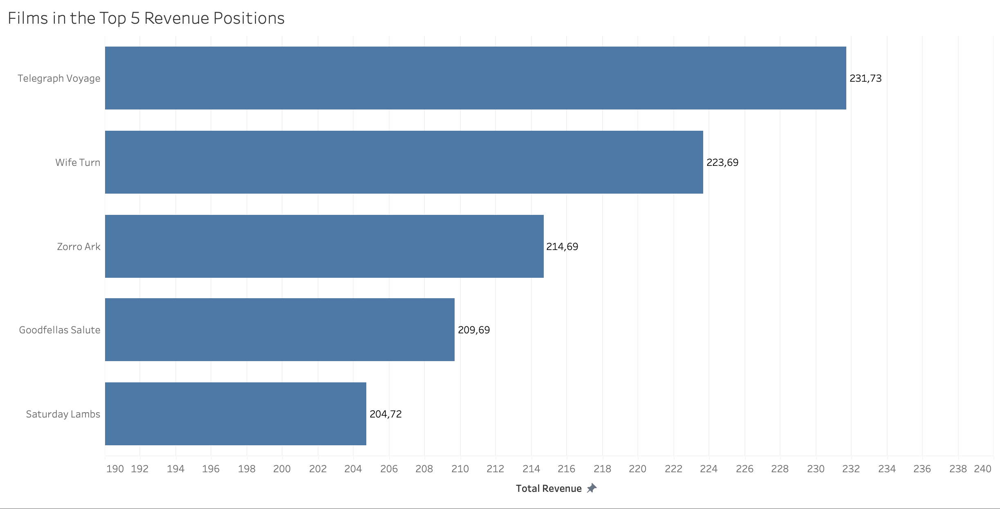
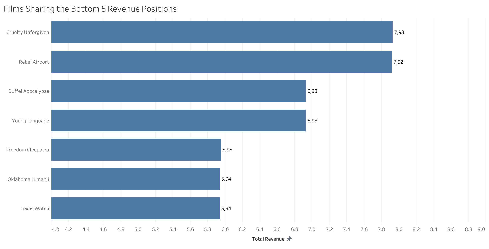
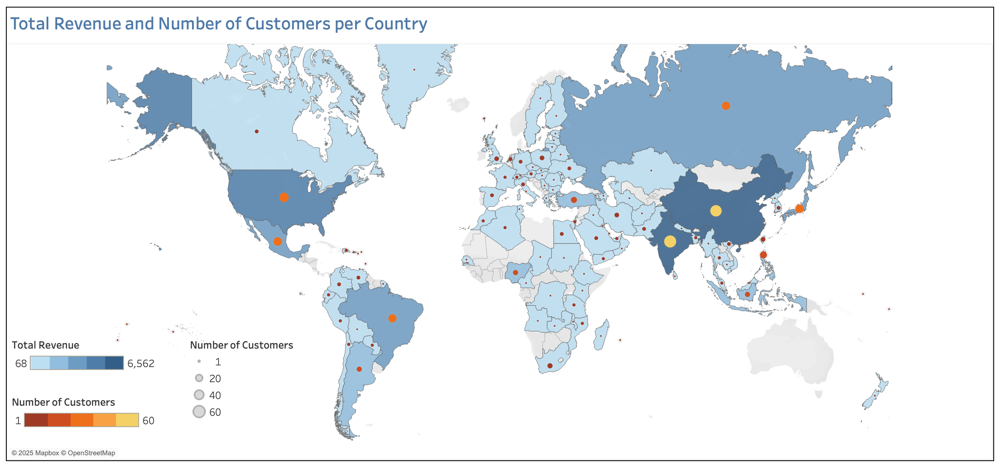

# Streaming Service Database Queries
*This project was completed as part of the [CareerFoundry Data Analytics Programme](https://careerfoundry.com/en/courses/become-a-data-analyst/).*

## Overview
A legacy movie rental company is planning to re-enter the market with a new online streaming service. This project supports the launch strategy by using SQL to query a relational database containing inventory, customer, and payment data. The analysis addresses a series of ad hoc business questions posed by management, helping to identify revenue-driving films, high-value markets, and regional sales trends to inform content strategy and customer targeting.
  

## Tools
- **Word** - Documentation
- **PostgreSQL** - Relational Database
- **Excel** - Output
- **Tableau** - Visualisation
- **PowerPoint** - Presentation
  

## Process
- **Understanding** - ERD Creation | Data Dictionary Documentation
- **Data Preparation** - Profiling | Integrity Checks | Quality Checks | Cleaning | Integration
- **Analysis** - Business Rule Validation | Ad Hoc Querying
- **Communication** - Visualisation | Presentation
  

## Data
This analysis uses a modified version of the DVD Rental dataset originally provided as a sample database for learning and testing SQL with PostgreSQL. The dataset was adapted and provided by CareerFoundry as part of their Data Analytics Programme.

- [**Dataset**](http://www.postgresqltutorial.com/wp-content/uploads/2019/05/dvdrental.zip) – Film, inventory, customer, payment, and rental records
  

## Links
- [**Entity Relationship Diagram**](deliverables/erd_dbvisualiser.png)
- [**Data Dictionary**](deliverables/data_dictionary.pdf)
- [**Interactive Tableau Dashboard**](https://public.tableau.com/views/StreamingService_17486375379040/Dashboard1?:language=en-GB&:sid=&:redirect=auth&:display_count=n&:origin=viz_share_link)
- [**Presentation**](deliverables/presentation.pdf)
  

## Key Insights
### 1. Customer Base, Catalogue, and Revenue Generated
<table>
  <tr>
    <td valign="middle">
      <table>
        <thead>
          <tr>
            <th align="left">Customer Base</th>
            <th align="right">Count</th>
          </tr>
        </thead>
        <tbody>
          <tr>
            <td align="left">Customers</td>
            <td align="right">599</td>
          </tr>
          <tr>
            <td align="left">Countries</td>
            <td align="right">108</td>
          </tr>
          <tr>
            <td align="left">Cities</td>
            <td align="right">597</td>
          </tr>
        </tbody>
      </table>
    </td>
    <td valign="middle" style="padding-left: 20px;">
      
<em>The business served a total of 599 customers, located in 597 cities across 108 countries worldwide.</em>

    </td>
  </tr>
</table>

<table>
  <tr>
    <td valign="middle">
      <table>
        <thead>
          <tr>
            <th align="left">Film Catalogue</th>
            <th align="right">Count</th>
          </tr>
        </thead>
        <tbody>
          <tr>
            <td align="left">Titles in Inventory</td>
            <td align="right">958</td>
          </tr>
          <tr>
            <td align="left">Categories</td>
            <td align="right">16</td>
          </tr>
          <tr>
            <td align="left">Ratings</td>
            <td align="right">5</td>
          </tr>
          <tr>
            <td align="left">Languages</td>
            <td align="right">1 (English)</td>
          </tr>
          <tr>
            <td>Release Year</td>
            <td align="right">1 (2006)</td>
          </tr>
        </tbody>
      </table>
    </td>
    <td valign="middle" style="padding-left: 20px;">
      
<em>The catalogue included 958 English-language titles, all released in 2006, spanning 16 categories and five ratings.</em>

    </td>
  </tr>
</table>

<table>
  <tr>
    <td valign="middle">
      <table>
        <thead>
          <tr>
            <th align="left">Revenue</th>
            <th align="right">Amount (¤)</th>
          </tr>
        </thead>
        <tbody>
          <tr>
            <td align="left">Paid</td>
            <td align="right">60 784,91</td>
          </tr>
          <tr>
            <td align="left">Accrued</td>
            <td align="right">6 103,48</td>
          </tr>
          <tr>
            <td align="left">Total Revenue</td>
            <td align="right">66 888,39</td>
          </tr>
        </tbody>
      </table>
    </td>
    <td valign="middle" style="padding-left: 20px;">
      
<em>Total revenue amounted to ¤66,888, consisting of ¤60,785 in payments received and ¤6,103 in accrued charges from rentals that were returned but not yet paid.</em>

    </td>
  </tr>
</table>
 

### 2. Revenue Contribution by Title
The distribution of revenue was highly uneven with the top five highest-grossing titles each earning over ¤200, while the lowest performers brought in less than ¤8 each.
<table>
<tr>
<td align="center" valign="top" width="100%">
     
    <em>The top five titles earned between ¤204.72 and ¤231.73, led by “Telegraph Voyage”, “Wife Turn”, and “Zorro Ark”.</em>
</td>
</tr>
</table>
 

<table>
<tr>
<td align="center" valign="top" width="100%">
     
    <em>Seven films shared the bottom five revenue positions, each earning between ¤5.94 and ¤7.93 over the period. “Texas Watch” and “Oklahoma Jumanji” recorded the lowest earnings at ¤5.94.</em>
</td>
</tr>
</table>
 

### 3. Rental Return Behaviour
Although each film was assigned a fixed rental term between 3 and 7 days, actual return behaviour showed little variation, ranging from same-day returns to as long as 10 days, with an average of 5 days. Most returns were evenly distributed between 1 and 9 days regardless of the assigned duration, with notably fewer same-day and 10-day returns, suggesting that assigned terms had limited influence on actual return behaviour.
  

**Summary Statistics - Actual Rental Duration by Rental Term**
| Rental Duration (Days) | Number of Transactions | Minimum Actual Duration | Maximum Actual Duration | Average Actual Duration |
|:---:|:---:|:---:|:---:|:---:|
| 3 | 3,366 | 0 | 10 | 5 |
| 4 | 3,213 | 0 | 10 | 5 |
| 5 | 3,132 | 0 | 10 | 5 |
| 6 | 3,352 | 0 | 10 | 5 |
| 7 | 2,798 | 0 | 10 | 5 |
| All | 15,861 | 0 | 10 | 5 |

<em>Returns were evenly distributed across rental terms, with actual durations ranging from 0 to 10 days, with an average of 5 days.</em>

  

 

**Transaction Distribution – Actual Rental Duration per Rental Term**
<table>
  <thead>
    <tr>
      <th rowspan="2" style="text-align: center;">Rental Term (Days)</th>
      <th colspan="11" style="text-align: center;">Actual Duration (Days)</th>
    </tr>
    <tr>
      <th style="text-align: center;">0 Days</th>
      <th style="text-align: center;">1 Days</th>
      <th style="text-align: center;">2 Days</th>
      <th style="text-align: center;">3 Days</th>
      <th style="text-align: center;">4 Days</th>
      <th style="text-align: center;">5 Days</th>
      <th style="text-align: center;">6 Days</th>
      <th style="text-align: center;">7 Days</th>
      <th style="text-align: center;">8 Days</th>
      <th style="text-align: center;">9 Days</th>
      <th style="text-align: center;">10 Days</th>
    </tr>
  </thead>
  <tbody>
    <tr><td align="center">3</td><td align="center">18</td><td align="center">356</td><td align="center">370</td><td align="center">371</td><td align="center">358</td><td align="center">400</td><td align="center">366</td><td align="center">357</td><td align="center">385</td><td align="center">360</td><td align="center">25</td></tr>
    <tr><td align="center">4</td><td align="center">22</td><td align="center">309</td><td align="center">361</td><td align="center">369</td><td align="center">339</td><td align="center">337</td><td align="center">401</td><td align="center">358</td><td align="center">363</td><td align="center">335</td><td align="center">19</td></tr>
    <tr><td align="center">5</td><td align="center">26</td><td align="center">336</td><td align="center">375</td><td align="center">337</td><td align="center">327</td><td align="center">331</td><td align="center">344</td><td align="center">361</td><td align="center">346</td><td align="center">335</td><td align="center">14</td></tr>
    <tr><td align="center">6</td><td align="center">22</td><td align="center">342</td><td align="center">371</td><td align="center">354</td><td align="center">356</td><td align="center">383</td><td align="center">372</td><td align="center">430</td><td align="center">355</td><td align="center">345</td><td align="center">22</td></tr>
    <tr><td align="center">7</td><td align="center">17</td><td align="center">301</td><td align="center">318</td><td align="center">283</td><td align="center">301</td><td align="center">310</td><td align="center">300</td><td align="center">315</td><td align="center">313</td><td align="center">316</td><td align="center">24</td></tr>
  </tbody>
</table>

<em>Most returns were evenly spread between 1 and 9 days across all rental terms, with relatively few same-day or 10-day returns.</em>

 

### 4. Revenue and Customer Distribution by Country
With 599 customers across 597 cities in 108 countries, activity is concentrated in a few key markets. India, China, and the United States account for nearly a quarter of global customers and total revenue.

<table>
<tr>
<td align="center" valign="top" width="100%">
     
    <em>India, China, and the United States were the top 3 countries in terms of total revenue and number of customers.</em>
</td>
</tr>
</table>
 

**Top 10 Countries - Total Revenue and Number of Customers**
| # | Country | Customer Count | Total Revenue |
|:-:|:-------:|:--------------:|:-------------:|
| 1 | India | 60 | 6,628.28 |
| 2 | China | 53 | 5,798.74 |
| 3 | United States | 36 | 4,110.32 |
| 4 | Japan | 31 | 3,470.75 |
| 5 | Mexico | 30 | 3,307.04 |
| 6 | Brazil | 28 | 3,200.52 |
| 7 | Russian Federation | 28 | 3,045.87 |
| 8 | Philippines | 20 | 2,381.32 |
| 9 | Turkey | 15 | 1,662.12 |
| 10 | Indonesia | 14 | 1,510.33 |

The top 3 countries together account for 149 of global customers and ¤16,400.82 in total revenue.
  

### 5. Customer Lifetime Value by Country
Réunion, Vatican City, and Nauru had the highest average CLVs, each exceeding ¤140.
<table>
<tr>
<td align="center" valign="top" width="100%">
     
    <em>Countries with larger customer bases showed less variation in average CLV, while those with only one or two customers recorded the highest CLVs.</em>
</td>
</tr>
</table>
 

| # | Country | Customer Count | Total Revenue | Avg Lifetime Value |
|:-:|:-------:|:--------------:|:-------------:|:------------------:|
| 1 | Réunion | 1 | 216.54 | 216.54 |
| 2 | Vatican City | 1 | 152.66 | 152.66 |
| 3 | Nauru | 1 | 148.69 | 148.69 |
| 4 | Sweden | 1 | 144.66 | 144.66 |
| 5 | Hong Kong | 1 | 142.70 | 142.70 |
| 6 | Thailand | 3 | 419.04 | 139.68 |
| 7 | Belarus | 2 | 277.34 | 138.67 |
| 8 | Greenland | 1 | 137.66 | 137.66 |
| 9 | Turkmenistan | 1 | 136.73 | 136.73 |
| 10 | Chad | 1 | 135.68 | 135.68 |
 

### 6. Regional Sales Performance and Customer Numbers
Sales figures vary considerably across geographic regions, with the Asia-Pacific market emerging as the clear leader. This region accounted for the highest number of customers (235) and the greatest total revenue (¤26,468), more than double that of any other region.
<table>
<tr>
<td align="center" valign="top" width="100%">
     
    <em>...</em>
</td>
</tr>
</table>
 

## Takeaways
### Successes
The project successfully used SQL to query a relational database and extract relevant information in response to specific business questions.

### Challenges
The hypothetical nature of the dataset made it difficult to interpret patterns and anomalies. Without real-world context or business input, it was challenging to judge whether observations reflected meaningful or artificial behaviour which highlights the importance of stakeholder interaction when making analytical assumptions.

### Way Forward
For future projects, using more realistic datasets that better simulate real-world conditions would strengthen the reliability of insights and reduce ambiguity during analysis.
