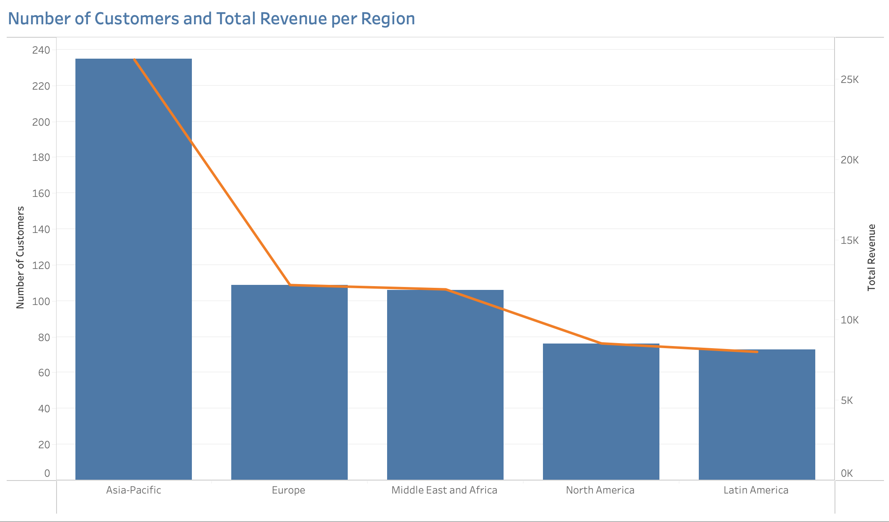

# Streaming Service Database Queries
*This project was completed as part of the [CareerFoundry Data Analytics Programme](https://careerfoundry.com/en/courses/become-a-data-analyst/).*

## Overview
A legacy movie rental company is planning to re-enter the market with a new online streaming service. This project supports the launch strategy by using SQL to query a relational database containing inventory, customer, and payment data. The analysis addresses a series of ad hoc business questions posed by management, helping to identify revenue-driving films, high-value markets, and regional sales trends to inform content strategy and customer targeting.
  

## Tools
- **PostgreSQL** - Relational Database Querying & Schema Exploration
- **Word** - Structural Documentation
- **Excel** - Output Delivery
- **Tableau** - Visualisation
- **PowerPoint** - Presentation
  

## Process
- **Structural Documentation** - Entity-Relationship Diagram Creation | Data Dictionary Preparation
- **Data Preparation** - Profiling | Integrity Checks | Quality Checks | Cleaning | Business Rule Validation | Integration
- **Analysis** - Descriptive Statistics | Trend Analysis
- **Communication** - Visualisation | Presentation
  

## Data
This analysis uses a modified version of the DVD Rental dataset originally provided as a sample database for learning and testing SQL with PostgreSQL. The dataset was adapted and provided by CareerFoundry as part of their Data Analytics Programme.
- [**Dataset**](http://www.postgresqltutorial.com/wp-content/uploads/2019/05/dvdrental.zip) – Film, inventory, customer, payment, and rental records
  

## Deliverables
- [**Entity Relationship Diagram**](deliverables/erd_dbvisualiser.png)
- [**Data Dictionary**](deliverables/data_dictionary.pdf)
- [**Interactive Tableau Dashboard**](https://public.tableau.com/views/StreamingService_17486375379040/Revenue_Customers?:language=en-GB&:sid=&:redirect=auth&:display_count=n&:origin=viz_share_link)
- [**Presentation**](deliverables/presentation.pdf)
  

## Key Insights
### 1. Customer Base, Catalogue, and Revenue Generated

<table>
  <tr>
    <th align="center" width="33%">Customer Base</th>
    <th align="center" width="33%">Film Catalogue</th>
    <th align="center" width="33%">Revenue Earned</th>
  </tr>
  <tr>
    <td align="center" valign="middle" width="33%">
      <table>
        <tbody>
          <tr><td align="left">Customers</td><td align="right">599</td></tr>
          <tr><td align="left">Countries</td><td align="right">108</td></tr>
          <tr><td align="left">Cities</td><td align="right">597</td></tr>
        </tbody>
      </table>
    </td>
    <td align="center" valign="middle" width="33%">
      <table>
        <tbody>
          <tr><td align="left">Titles (Inventory)</td><td align="center">958</td></tr>
          <tr><td align="left">Categories</td><td align="center">16</td></tr>
          <tr><td align="left">Ratings</td><td align="center">5</td></tr>
          <tr><td align="left">Languages</td><td align="center">1 (English)</td></tr>
          <tr><td align="left">Release Year</td><td align="center">1 (2006)</td></tr>
        </tbody>
      </table>
    </td>
    <td align="center" valign="middle" width="33%">
      <table>
        <tbody>
          <tr><td align="left">Paid</td><td align="right">60 784,91</td></tr>
          <tr><td align="left">Accrued</td><td align="right">6 103,48</td></tr>
          <tr><td align="left">Total Revenue</td><td align="right">66 888,39</td></tr>
        </tbody>
      </table>
    </td>
  </tr>
  <tr>
    <td align="center" valign="middle" width="33%">
      
<em>The business served a total of 599 customers, located in 597 cities across 108 countries worldwide.</em>

    </td>
    <td align="center" valign="middle" width="33%">
      
<em>The catalogue included 958 English-language titles, all released in 2006, spanning 16 categories and five ratings.</em>

    </td>
    <td align="center" valign="middle" width="33%">
      
<em>Total revenue amounted to ¤66 888,39 which included ¤6 103,48 in outstanding payments.</em>

    </td>
  </tr>
</table>
 

### 2. Revenue Contribution by Title
Film-level earnings varied significantly, with the top five highest-grossing titles each earning over ¤200, while the lowest performers brought in less than ¤8 each.

<table>
<tr>
<td align="center" valign="top" width="50%">
     
    <em>The top five titles earned between ¤204,72 and ¤231,73, led by “Telegraph Voyage”, “Wife Turn”, and “Zorro Ark”.</em>
</td>
<td align="center" valign="top" width="50%">
     
    <em>Seven films shared the bottom five revenue positions, each earning between ¤5,94 and ¤7,93 over the period. “Texas Watch” and “Oklahoma Jumanji” recorded the lowest earnings at ¤5,94.</em>
</td>
</tr>
</table>
 

### 3. Rental Return Behaviour
While each film was assigned a fixed rental term between 3 and 7 days, actual return behaviour showed little variation, ranging from same-day returns to as long as 10 days, with an average of 5 days. Most returns were evenly distributed between 1 and 9 days regardless of the assigned duration, with notably fewer same-day and 10-day returns, suggesting that specified terms had limited influence on actual return behaviour.
  

<table>
  <thead>
    <tr>
      <th colspan="5" style="text-align: center; font-weight: bold;">
        Summary Statistics – Actual Rental Duration per Rental Term
      </th>
    </tr>
    <tr>
      <th style="text-align: center;">Rental Duration (Days)</th>
      <th style="text-align: center;">Number of Transactions</th>
      <th style="text-align: center;">Minimum Actual Duration</th>
      <th style="text-align: center;">Maximum Actual Duration</th>
      <th style="text-align: center;">Average Actual Duration</th>
    </tr>
  </thead>
  <tbody>
    <tr>
      <td align="center">3 Days</td>
      <td align="center">3 366</td>
      <td align="center">0</td>
      <td align="center">10</td>
      <td align="center">5</td>
    </tr>
    <tr>
      <td align="center">4 Days</td>
      <td align="center">3 213</td>
      <td align="center">0</td>
      <td align="center">10</td>
      <td align="center">5</td>
    </tr>
    <tr>
      <td align="center">5 Days</td>
      <td align="center">3 132</td>
      <td align="center">0</td>
      <td align="center">10</td>
      <td align="center">5</td>
    </tr>
    <tr>
      <td align="center">6 Days</td>
      <td align="center">3 352</td>
      <td align="center">0</td>
      <td align="center">10</td>
      <td align="center">5</td>
    </tr>
    <tr>
      <td align="center">7 Days</td>
      <td align="center">2 798</td>
      <td align="center">0</td>
      <td align="center">10</td>
      <td align="center">5</td>
    </tr>
    <tr>
      <td align="center">All Terms</td>
      <td align="center">15 861</td>
      <td align="center">0</td>
      <td align="center">10</td>
      <td align="center">5</td>
    </tr>
  </tbody>
  <tfoot>
    <tr>
      <td colspan="5" align="center">
        <em>Returns were evenly distributed across rental terms, with actual durations ranging from 0 to 10 days and averaging 5 days.</em>
      </td>
    </tr>
  </tfoot>
</table>
 

<table>
  <thead>
    <tr>
      <th rowspan="2" style="text-align: center;">Rental Term</th>
      <th colspan="11" style="text-align: center;">Number of Transactions - Actual Rental Duration</th>
    </tr>
    <tr>
      <th style="text-align: center;">0 Days</th>
      <th style="text-align: center;">1 Days</th>
      <th style="text-align: center;">2 Days</th>
      <th style="text-align: center;">3 Days</th>
      <th style="text-align: center;">4 Days</th>
      <th style="text-align: center;">5 Days</th>
      <th style="text-align: center;">6 Days</th>
      <th style="text-align: center;">7 Days</th>
      <th style="text-align: center;">8 Days</th>
      <th style="text-align: center;">9 Days</th>
      <th style="text-align: center;">10 Days</th>
    </tr>
  </thead>
  <tbody>
    <tr><td align="center">3 Days</td><td align="center">18</td><td align="center">356</td><td align="center">370</td><td align="center">371</td><td align="center">358</td><td align="center">400</td><td align="center">366</td><td align="center">357</td><td align="center">385</td><td align="center">360</td><td align="center">25</td></tr>
    <tr><td align="center">4 Days</td><td align="center">22</td><td align="center">309</td><td align="center">361</td><td align="center">369</td><td align="center">339</td><td align="center">337</td><td align="center">401</td><td align="center">358</td><td align="center">363</td><td align="center">335</td><td align="center">19</td></tr>
    <tr><td align="center">5 Days</td><td align="center">26</td><td align="center">336</td><td align="center">375</td><td align="center">337</td><td align="center">327</td><td align="center">331</td><td align="center">344</td><td align="center">361</td><td align="center">346</td><td align="center">335</td><td align="center">14</td></tr>
    <tr><td align="center">6 Days</td><td align="center">22</td><td align="center">342</td><td align="center">371</td><td align="center">354</td><td align="center">356</td><td align="center">383</td><td align="center">372</td><td align="center">430</td><td align="center">355</td><td align="center">345</td><td align="center">22</td></tr>
    <tr><td align="center">7 Days</td><td align="center">17</td><td align="center">301</td><td align="center">318</td><td align="center">283</td><td align="center">301</td><td align="center">310</td><td align="center">300</td><td align="center">315</td><td align="center">313</td><td align="center">316</td><td align="center">24</td></tr>
    <tr><td align="center">All Terms</td><td align="center">105</td><td align="center">1 644</td><td align="center">1 795</td><td align="center">1 714</td><td align="center">1 681</td><td align="center">1 761</td><td align="center">1 783</td><td align="center">1 821</td><td align="center">1 762</td><td align="center">1 691</td><td align="center">104</td></tr>
  </tbody>
  <tfoot>
    <tr>
      <td colspan="12" align="center">
        <em>Most returns were evenly spread between 1 and 9 days across all rental terms, with relatively few same-day or 10-day returns.</em>
      </td>
    </tr>
  </tfoot>
</table>
 

### 4. Revenue and Customer Distribution by Country
Customer activity was highly concentrated in a small number of high-volume markets. Just 10 out of 108 countries accounted for 53% of all customers (315 of 599) and 52% of total revenue (¤34 868,18 of ¤66 888,39). Notably, these countries also ranked identically in both metrics, indicating a strong alignment between customer volume and sales contribution.

<table>
  <thead>
    <tr>
      <th colspan="4" align="center">Top 10 Countries – Total Revenue and Number of Customers</th>
    </tr>
    <tr>
      <th align="center">#</th>
      <th align="left">Country</th>
      <th align="center">Customer Count</th>
      <th align="right">Total Revenue (¤)</th>
    </tr>
  </thead>
  <tbody>
    <tr>
      <td align="center">1</td>
      <td align="left">India</td>
      <td align="center">60</td>
      <td align="right">6 561,52</td>
    </tr>
    <tr>
      <td align="center">2</td>
      <td align="left">China</td>
      <td align="center">53</td>
      <td align="right">5 757,87</td>
    </tr>
    <tr>
      <td align="center">3</td>
      <td align="left">United States</td>
      <td align="center">36</td>
      <td align="right">4 081,43</td>
    </tr>
    <tr>
      <td align="center">4</td>
      <td align="left">Japan</td>
      <td align="center">31</td>
      <td align="right">3 447,84</td>
    </tr>
    <tr>
      <td align="center">5</td>
      <td align="left">Mexico</td>
      <td align="center">30</td>
      <td align="right">3 293,10</td>
    </tr>
    <tr>
      <td align="center">6</td>
      <td align="left">Brazil</td>
      <td align="center">28</td>
      <td align="right">3 177,59</td>
    </tr>
    <tr>
      <td align="center">7</td>
      <td align="left">Russian Federation</td>
      <td align="center">28</td>
      <td align="right">3 037,91</td>
    </tr>
    <tr>
      <td align="center">8</td>
      <td align="left">Philippines</td>
      <td align="center">20</td>
      <td align="right">2 355,42</td>
    </tr>
    <tr>
      <td align="center">9</td>
      <td align="left">Turkey</td>
      <td align="center">15</td>
      <td align="right">1 651,15</td>
    </tr>
    <tr>
      <td align="center">10</td>
      <td align="left">Indonesia</td>
      <td align="center">14</td>
      <td align="right">1 504,35</td>
    </tr>
    <tr>
      <td align="center">Total</td>
      <td align="left"></td>
      <td align="center">315</td>
      <td align="right">34 868,18</td>
    </tr>
  </tbody>
  <tfoot>
    <tr>
      <td colspan="4" align="center"><em>The top 10 countries accounted for 315 customers and generated ¤34 868,18 in total revenue, with both metrics ranked in identical order.</em></td>
    </tr>
  </tfoot>
</table>
 

<table>
<tr>
<td align="center" valign="top" width="100%">
     
    <em>India and China emerged as dominant markets, each with over 50 customers generating more than ¤5 750,00 in revenue.</em>
</td>
</tr>
</table>
 

### 5. Customer Spending
Top-spending customers were not limited to high-volume markets. They came from a diverse mix of countries, including major markets such as the United States and India, as well as smaller ones like Réunion and Belarus.

<table style="width: 100%;">
  <thead>
    <tr>
      <th colspan="4" style="text-align: center; font-weight: bold;">Top 10 Customers</th>
    </tr>
    <tr>
      <th align="center">Rank</th>
      <th align="center">Customer ID</th>
      <th align="center">Country</th>
      <th align="right">Total Spent (¤)</th>
    </tr>
  </thead>
  <tbody>
    <tr>
      <td align="center">1</td>
      <td align="center">526</td>
      <td align="center">United States</td>
      <td align="right">221,55</td>
    </tr>
    <tr>
      <td align="center">2</td>
      <td align="center">148</td>
      <td align="center">Réunion</td>
      <td align="right">216,54</td>
    </tr>
    <tr>
      <td align="center">3</td>
      <td align="center">144</td>
      <td align="center">Belarus</td>
      <td align="right">195,58</td>
    </tr>
    <tr>
      <td align="center">4</td>
      <td align="center">137</td>
      <td align="center">Netherlands</td>
      <td align="right">194,61</td>
    </tr>
    <tr>
      <td align="center">5</td>
      <td align="center">178</td>
      <td align="center">Brazil</td>
      <td align="right">189,62</td>
    </tr>
    <tr>
      <td align="center">6</td>
      <td align="center">459</td>
      <td align="center">Iran</td>
      <td align="right">186,62</td>
    </tr>
    <tr>
      <td align="center">7</td>
      <td align="center">469</td>
      <td align="center">Spain</td>
      <td align="right">177,60</td>
    </tr>
    <tr>
      <td align="center">8</td>
      <td align="center">468</td>
      <td align="center">India</td>
      <td align="right">175.61</td>
    </tr>
    <tr>
      <td align="center">9</td>
      <td align="center">236</td>
      <td align="center">Philippines</td>
      <td align="right">174,59</td>
    </tr>
    <tr>
      <td align="center">10</td>
      <td align="center">176</td>
      <td align="center">Algeria</td>
      <td align="right">173,63</td>
    </tr>
    <tr>
      <td align="center">Total</td>
      <td align="center"></td>
      <td align="center"></td>
      <td align="right">1 905,95</td>
    </tr>
  </tbody>
  <tfoot>
    <tr>
      <td colspan="4" style="text-align: center;"><em>Despite their high individual spending, the combined contribution of the top 10 customers amounted to just ¤1 905,95 (3% of the ¤66 888,39 total revenue).</em></td>
    </tr>
  </tfoot>
</table>
 

### 6. Regional Sales Performance and Customer Numbers
Sales performance varies markedly by region, with Asia-Pacific emerging as the clear leader in both customer volume and total revenue. The chart suggests a strong positive relationship between the number of customers and total revenue across regions, reinforcing the importance of market penetration for driving sales outcomes.
<table>
<tr>
<td align="center" valign="top" width="100%">
     
    <em>Asia-Pacific stands out with 235 customers and a total revenue of ¤26,233 — more than double the revenue of any other region. Europe and the Middle East and Africa follow with similar customer counts (109 and 106) and total revenues (¤12,182 and ¤11,912 respectively). North America and Latin America report lower figures, with fewer than 80 customers each and total revenues under ¤8,600.</em>
</td>
</tr>
</table>
 

## Takeaways
### Successes
The project successfully used SQL to query a relational database and extract relevant information in response to specific business questions.

### Challenges
The hypothetical nature of the dataset made it difficult to interpret patterns and anomalies. Without real-world context or business input, it was challenging to judge whether observations reflected meaningful or artificial behaviour which highlights the importance of stakeholder interaction when making analytical assumptions.

### Way Forward
For future projects, using more realistic datasets that better simulate real-world conditions would strengthen the reliability of insights and reduce ambiguity during analysis.
